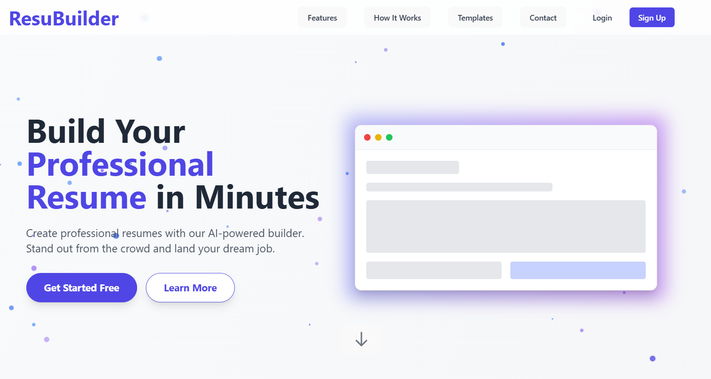
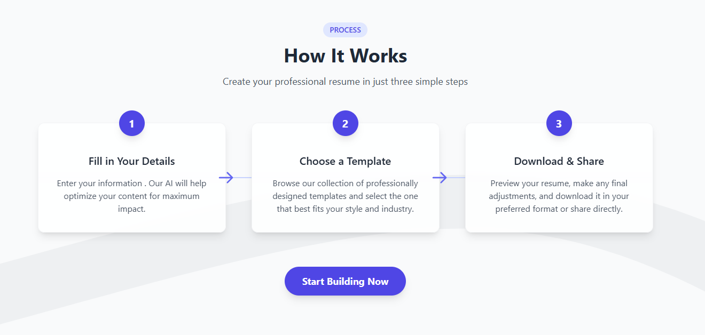
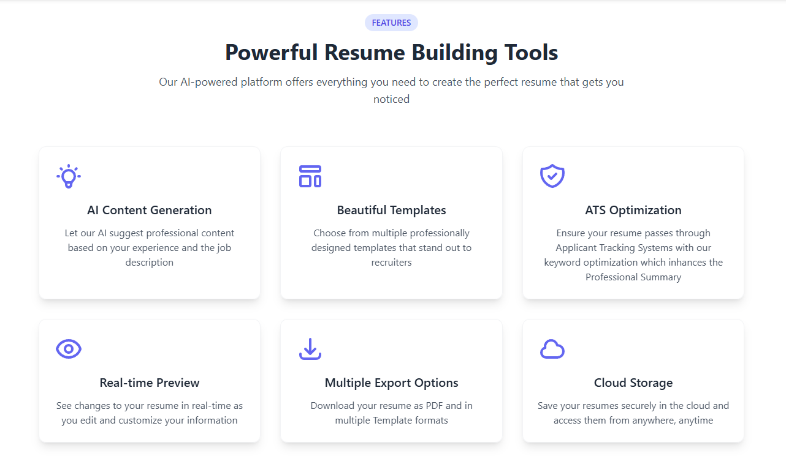

<p align="center">
  
</p>

<h1 align="center">ResuBuilder - AI-Powered Resume Builder</h1>

<p align="center">
  Create professional resumes in minutes with AI assistance, real-time preview, and multiple templates.
</p>

<p align="center">
  <a href="https://skillicons.dev">
    
  </a>
</p>

<p align="center">
  
</p>

## ✨ Features

- 🤖 **AI-Powered Summaries**: Generate professional summaries instantly using Google's Gemini AI
- 👁️ **Real-time Preview**: See changes as you type with live preview
- 🎨 **Multiple Templates**: Choose from Professional, Creative, and Minimal designs
- 🔄 **Easy Updates**: Edit, update, and maintain multiple resumes
- 📱 **Responsive Design**: Works seamlessly on desktop and mobile
- 🌐 **Share Online**: Generate shareable links for your resumes
- 💾 **Auto-save**: Never lose your progress with automatic saving
- 🔒 **Secure**: Protected user data and authentication

## 🚀 Tech Stack

### Frontend
- React + Vite
- Tailwind CSS
- Framer Motion
- Axios
- React Router DOM
- React Icons

### Backend
- Node.js
- Express.js
- MongoDB
- JWT Authentication
- Google Gemini AI API
- Puppeteer (PDF Generation)

## 🌐 Live Demo

Check out the live application: [ResuBuilder](https://resubilder-frontend.vercel.app/)

## 📸 Screenshots

<div align="center">
  
  <p><em>Landing Page</em></p>
  
  
  <p><em>How it works</em></p>
  
  
  <p><em>Features</em></p>
  
</div>

## 🛠️ Installation

1. **Clone the repository**
```bash
git clone https://github.com/Vaibhavk121/Resubuilder.git
cd Resubuilder-Complete
```
2. **Install dependencies**
```bash
# Install frontend dependencies
cd client
npm install

# Install backend dependencies
cd ../server
npm install
```
3. **Set up environment variables**
```bash
# In server/.env
MONGODB_URI=your_mongodb_uri
JWT_SECRET=your_jwt_secret
GEMINI_API_KEY=your_gemini_api_key
```
4. **Run the application**
```bash
# Start backend server
cd server
npm start

# Start frontend development server
cd ../client
npm run dev
```

## 💡 Usage

1. **Create Account**: Sign up with email and password
2. **Choose Template**: Select from Professional, Creative, or Minimal
3. **Fill Details**: Input your information with AI assistance
4. **Preview & Download**: Get instant preview and export as PDF
5. **Share**: Generate shareable link for your resume

## 🎯 Key Features Explained

- **AI Summary Generation**: Utilizes Google's Gemini AI to create compelling professional summaries
- **Template System**: Three distinct templates with customizable sections
- **Real-time Preview**: Side-by-side editing and preview
- **Export Options**: Download as PDF or share via link
- **Cloud Storage**: Securely store and manage multiple resumes

## 🌟 Contributing

1. Fork the repository
2. Create your feature branch (`git checkout -b feature/AmazingFeature`)
3. Commit your changes (`git commit -m 'Add some AmazingFeature'`)
4. Push to the branch (`git push origin feature/AmazingFeature`)
5. Open a Pull Request

## 📝 License

Distributed under the MIT License. See `LICENSE` for more information.

## 👤 Contact

**Vaibhav Kumar**
- [LinkedIn](https://www.linkedin.com/in/vaibhav-kumar-b366872a6/)
- [GitHub](https://github.com/Vaibhavk121)

## 🙏 Acknowledgments

- React Icons
- Tailwind CSS
- Framer Motion
- Google Gemini AI

---

<p align="center">
  Made with ❤️ by <a href="https://github.com/Vaibhavk121">Vaibhav Kumar</a>
</p>


